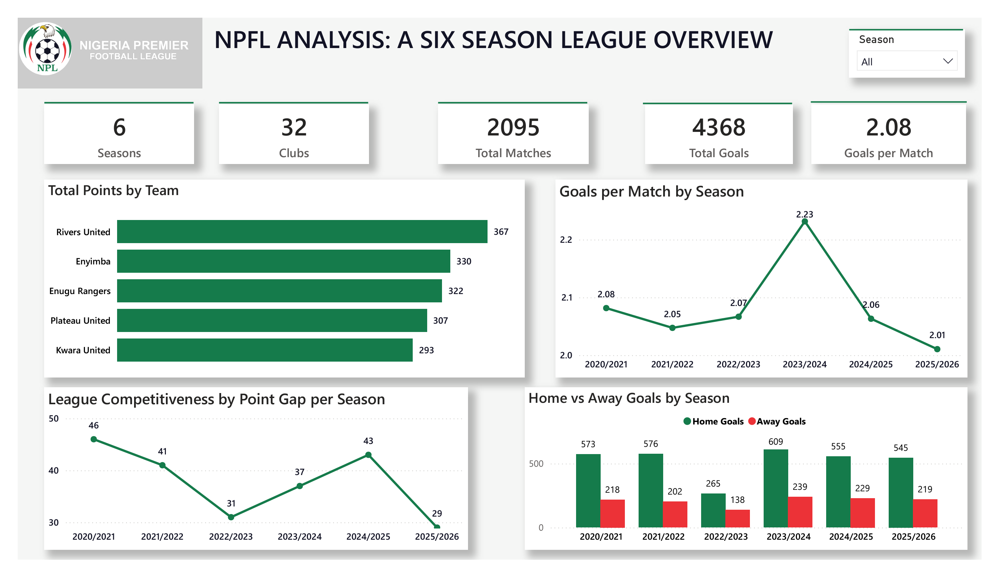

# NPFL Data Analytics

## Analysing Geography, Population, Club Performance and League Competitiveness in the Nigerian Premier Football League



## Project Overview

The Nigerian Premier Football League (NPFL) is Nigeria's highest level of domestic professional football and represents an important part of the country's sporting ecosystem.

This project analyses six seasons of NPFL data from **2020/21 to 2025/26** to investigate the relationship between geography, population and football performance while also examining league competitiveness, club consistency, home advantage, player contribution and stadium environments.

The project combines:

- **SQL Server** for data warehousing and relational modelling
- **Python** for data preparation, statistical analysis and predictive modelling
- **Power BI** for interactive reporting and analytical storytelling
- **DAX** for season-aware performance measures and ranking calculations
- **PowerPoint** for communicating key findings and strategic recommendations

The central question behind the project was:

> **Does population and geography explain football performance in the NPFL, or are other sporting and structural factors more important?**

The analysis suggests that **population size alone does not explain club performance**. Instead, the strongest patterns emerge around sustained club performance, home advantage, competitive balance, player contribution and the broader sporting environment.

---

## Project Objective

> **To analyse the relationship between geography, population, and club performance in the Nigerian Premier Football League from 2020 to 2025, while evaluating league competitiveness and identifying trends in team and player performance through data-driven analysis.**

The project was designed to move beyond simply describing league tables.

It investigates:

1. Whether larger populations are associated with stronger NPFL clubs
2. Whether geographic location is associated with differences in club performance
3. Whether the league is becoming more or less competitive
4. Which clubs demonstrate sustained performance over time
5. How strong home advantage is within the NPFL
6. Which players and positions contribute most to scoring
7. How stadium environments differ in match activity and goal patterns
8. Whether football performance can be meaningfully modelled using match-level features
9. What the findings imply for the development of the NPFL ecosystem

---

# Dataset Scope

The analysis covers six NPFL seasons:

| Season | Coverage |
|---|---|
| 2020/21 | Included |
| 2021/22 | Included |
| 2022/23 | Abridged season |
| 2023/24 | Included |
| 2024/25 | Included |
| 2025/26 | Included |

Across the analysis, the Power BI report contains:

- **2,095 matches**
- **4,368 goals**
- **32 clubs**
- **2.08 goals per match**
- **6 seasons**

The 2022/23 season is treated separately where appropriate because it contains fewer matches than the other seasons.

---

# Analytical Questions

The project was organised around several analytical questions.

### Geography & Population

- Do clubs from more populated states perform better?
- Does population size explain differences in club PPG?
- Are there meaningful differences between Nigeria's geopolitical zones?
- Is there evidence of a simple north-versus-south performance divide?

### Club Performance

- Which clubs have been the strongest across the six-season period?
- Which clubs have improved?
- Which clubs have declined?
- Which clubs have demonstrated sustained Top-5 performance?

### League Competitiveness

- Is the gap between stronger and weaker clubs changing?
- Is variation in club PPG increasing or decreasing?
- Has competitive balance improved across the six seasons?

### Home Advantage

- How much stronger are clubs at home?
- Which clubs have the largest home/away PPG differences?
- Does home advantage remain consistent across seasons?

### Player Performance

- Who are the leading goal scorers?
- How does scoring relate to appearances?
- Which players demonstrate strong scoring efficiency?
- Which playing positions contribute most to goals?

### Stadium & Match Environment

- Which stadiums host the most matches?
- Does stadium capacity correspond with match usage?
- Which stadiums have higher average goals per match?
- Which stadiums show the strongest **stadium-associated home advantage**?

### Predictive Modelling

- Which match-performance variables are most useful for predicting match outcomes?
- Can historical team and match statistics meaningfully distinguish home wins, draws and away wins?

---

# Data Architecture

The project follows an analytical pipeline from source data through data engineering, analysis and reporting:

```text
Licensed Football Data
        │
        ▼
Data Cleaning & Preparation
        │
        ▼
SQL Server Data Warehouse
        │
        ▼
Python Statistical Analysis
        │
        ├── Exploratory Analysis
        ├── Correlation Testing
        ├── Competitiveness Analysis
        ├── Player Analysis
        └── Predictive Modelling
        │
        ▼
Power BI / DAX
        │
        ▼
Analytical Report
        │
        ▼
Key Insights & Recommendations
```

---

# SQL Data Warehouse

The SQL layer was used to transform the source datasets into a structured analytical warehouse.

The warehouse uses three main schemas:

```text
stg   → Staging
dim   → Dimensions
fact  → Facts
```

### Dimension tables

- `dim_states`
- `dim_seasons`
- `dim_players`
- `dim_dates`
- `dim_stadiums`
- `dim_teams`

### Fact tables

- `fact_matches`
- `fact_player_stats`
- `fact_team_stats`

The warehouse demonstrates:

- Relational data modelling
- Star-schema design
- Primary and foreign keys
- Staging tables
- `BULK INSERT`
- Data-type conversion
- `TRY_CAST()`
- Duplicate handling
- Referential integrity
- Data validation
- Analytical fact and dimension design

See the [`sql/`](sql/) directory for the SQL implementation and warehouse documentation.

---

# Python Analysis

Python was used as the main statistical and analytical layer.

The workflow included:

1. Data loading
2. Data inspection
3. Data-quality assessment
4. Cleaning and preparation
5. Feature engineering
6. Team performance aggregation
7. Player performance analysis
8. Home and away analysis
9. Geographic and population analysis
10. League competitiveness analysis
11. Statistical testing
12. xG efficiency analysis
13. First-half and second-half analysis
14. Predictive modelling
15. Model evaluation

### Team metrics

The analysis examined:

- Matches played
- Wins
- Draws
- Losses
- Goals scored
- Goals conceded
- Goal difference
- Points
- Points per game
- Home PPG
- Away PPG
- League position

League points were derived using:

```text
Points = (Wins × 3) + Draws
```

### Player metrics

Player analysis included:

- Goals
- Appearances
- Minutes played
- Goals per 90
- Playing position
- Goal contribution
- Expected goals where available

A minimum playing-time threshold was applied when evaluating scoring efficiency to reduce the effect of players with very limited playing time.

See [`python/`](python/) for the analytical notebooks and methodology.

---

# Statistical Analysis

Several statistical techniques were used to test relationships rather than relying only on visual patterns.

## Population vs Club Performance

The analysis found **no statistically significant relationship** between state population and club performance in the project sample.

The Pearson correlation between population and average PPG was:

```text
r = 0.124
p = 0.5548
```

The Spearman correlation between population and total points was:

```text
ρ = 0.0546
p = 0.7954
```

These results suggest that larger population alone was not a reliable explanation for stronger club performance.

This was one of the project's central findings.

---

# Key Findings

## 1. Population Does Not Explain Club Performance

The analysis did not find statistically significant evidence that clubs from more populated states consistently achieve higher performance.

This challenges the simple assumption that a larger population automatically produces a stronger NPFL club.

The relationship between population and club PPG was weak, while the relationship between population and total points was also very weak.

### Interpretation

Population may provide a larger potential talent and supporter base, but the analysis suggests that population by itself does not determine sporting success.

Other factors such as:

- Club management
- Sporting infrastructure
- Recruitment
- Coaching
- Academy development
- Financial resources
- Competitive continuity

may be more important, although this project does not establish those factors causally.

---

# 2. Geography Matters, But There Is No Simple North-South Divide

Club performance varied across Nigeria's geopolitical zones.

The strongest average club PPG was observed in the southern zones, particularly:

| Geopolitical Zone | Average Club PPG |
|---|---:|
| South South | 1.45 |
| South West | 1.42 |
| South East | 1.42 |
| North Central | 1.36 |
| North West | 1.36 |
| North East | 1.15 |

The results show geographic differences, but they do not support reducing NPFL performance to a simple north-versus-south classification.

Individual clubs and states also demonstrate that performance can vary substantially within the same broad geographic region.

---

# 3. NPFL Competitiveness Improved Over the Six Seasons

One of the strongest trends in the project was the reduction in variation between clubs.

The PPG coefficient of variation changed across the six seasons:

```text
2020/21   22.28%
2021/22   13.70%
2022/23   36.09%
2023/24   15.71%
2024/25   16.99%
2025/26   16.80%
```

The 2022/23 season stands out because it was an abridged season.

Outside that exception, the later seasons show a more compressed competitive distribution.

The PPG spread also declined from:

```text
2020/21   1.21
2025/26   0.74
```

This represents an approximate **39% reduction in the PPG spread** between the first and final seasons.

### Interpretation

The evidence suggests that competitive balance improved toward 2025/26.

However, competitive balance should not automatically be interpreted as an increase in overall league quality. A more competitive league can result from weaker clubs improving, stronger clubs declining, or both.

---

# 4. Sustained Success Is Concentrated Among a Smaller Group of Clubs

Across the six-season period, several clubs repeatedly appeared among the strongest performers.

Examples include:

- Rivers United
- Enyimba
- Enugu Rangers
- Plateau United
- Remo Stars
- Kano Pillars
- Abia Warriors

Rivers United recorded the highest overall points total in the project's six-season club analysis, followed by Enyimba and Enugu Rangers.

The sustained-success analysis also shows repeated high finishes among a smaller group of clubs rather than a completely random distribution of success.

### Interpretation

The NPFL appears to have a core group of clubs capable of sustaining relatively strong performance over multiple seasons.

This suggests that long-term sporting systems may matter more than one-season performance spikes.

---

# 5. Home Advantage Is a Major NPFL Characteristic

Across the analysis:

```text
Home PPG = 2.18
Away PPG = 0.56
```

Home teams therefore averaged almost four times as many points per game as away teams.

The overall match-result distribution was:

```text
Home Win   63.68%
Draw       24.47%
Away Win   11.84%
```

Home advantage was also visible at club level.

Several clubs recorded particularly large home-versus-away PPG differences.

### Interpretation

Home advantage is one of the strongest recurring patterns in the dataset.

Possible explanations could include familiarity with the venue, travel demands, crowd environment and other contextual factors.

However, this analysis identifies an association rather than proving a causal mechanism.

---

# 6. Player Goal Contribution Is Concentrated Among Forwards

For the 2025/26 player analysis, goal contribution was distributed approximately as:

| Position | Goal Contribution |
|---|---:|
| Forward | 63.72% |
| Midfielder | 21.48% |
| Defender | 14.80% |

Forwards therefore accounted for almost two-thirds of recorded goal contribution in the analysis.

The player analysis also compared goals with appearances and evaluated scoring efficiency among players with at least 900 minutes.

### Interpretation

The concentration of goal contribution among forwards is consistent with their attacking role, while the efficiency analysis helps distinguish high-volume scorers from players who score efficiently relative to playing time.

---

# 7. xG Efficiency Provides Useful but Cautious Context

The analysis compared actual goals with modelled expected goals.

Some clubs recorded substantially more goals than their modelled xG, while others recorded less.

The highest actual-goals-to-xG ratios included:

- El-Kanemi Warriors
- Kano Pillars
- Katsina United
- Enugu Rangers
- Kun Khalifat

However, the ratio should not be interpreted as definitive proof of superior finishing ability.

Expected goals depend on the underlying model and its calibration.

Therefore:

> **Actual goals versus xG is treated as an efficiency indicator rather than a definitive measure of finishing skill.**

---

# 8. Stadiums Are Part of the League Product

The stadium analysis examined:

- Match usage
- Stadium capacity
- Average goals
- Home/away performance
- Stadium-associated home advantage

The most-used venues included:

- Enyimba International Stadium
- Godswill Akpabio International Stadium
- Pantami Stadium
- New Jos Stadium
- Nnamdi Azikiwe Stadium

Some stadiums also showed notably high average goals per match and large home-versus-away PPG differences.

### Interpretation

Stadiums should not be viewed purely as physical venues.

They form part of the wider NPFL matchday and commercial product through:

- Match environment
- Supporter experience
- Broadcast presentation
- Venue infrastructure
- Capacity
- Accessibility
- Club identity

The analysis uses the term **stadium-associated home advantage** because the available data does not establish that stadium characteristics themselves cause the observed performance differences.

---

# 9. Predictive Modelling Shows Strong Home-Win Recognition but Class Imbalance

A Random Forest classification model was developed to investigate relationships between match-performance variables and match outcomes.

The model achieved approximately:

```text
Overall accuracy ≈ 64.9%
```

However, the model showed substantial class imbalance.

It was highly effective at identifying home wins but performed poorly when identifying draws and away wins.

Important model features included:

- PPG differential
- Win percentage
- Goals scored per match
- Goals conceded per match
- Clean-sheet percentage
- Shots on target
- Possession
- xG for
- xG against

### Interpretation

The model demonstrates that historical team-performance variables contain predictive information.

However, the overall accuracy figure should **not** be interpreted as evidence of balanced predictive performance because the model strongly favoured the majority outcome class.

Feature importance should also be interpreted as model association rather than causal influence.

---

# Power BI Report

The Power BI report translates the analytical work into an interactive reporting environment.

## Report Pages

### 1. NPFL League Overview

Provides a six-season overview of:

- Matches
- Goals
- Goals per match
- Club points
- Seasonal scoring trends
- League competitiveness

### 2. Home Advantage & Club Performance

Examines:

- Home vs away goals
- Home vs away PPG
- Club performance
- Goals conceded
- Overall match outcomes

### 3. Geography, Population & Club Success

Examines:

- Population vs club PPG
- Population vs state performance
- Geopolitical-zone performance
- Club distribution by geopolitical zone

### 4. Competitiveness & Club Trends

Examines:

- Competitiveness across seasons
- Home advantage trends
- Start-to-end club performance change
- Sustained club success

### 5. Player Performance & Goal Contribution

Examines:

- Top goalscorers
- Goals vs appearances
- Scoring efficiency
- Goal contribution by position

### 6. Stadium & Match Environment

Examines:

- Most-used stadiums
- Stadium capacity vs matches hosted
- Average goals by stadium
- Stadium-associated home advantage

---

# Dashboard Design

The Power BI report was designed around analytical storytelling rather than simply displaying as many metrics as possible.

The report uses:

- Season slicers
- Ranking visuals
- Scatter plots
- Trend charts
- Matrix heatmaps
- Conditional formatting
- Comparative bar charts
- Donut charts
- Context-aware DAX measures
- Multi-page navigation

The objective was to ensure that each report page answers a specific analytical question.

---

# Technical Skills Demonstrated

## SQL

- SQL Server
- Data warehousing
- Dimensional modelling
- Star-schema design
- Staging tables
- `BULK INSERT`
- `TRY_CAST`
- `SELECT DISTINCT`
- Primary keys
- Foreign keys
- Data validation
- Relational data modelling

## Python

- Pandas
- NumPy
- Exploratory data analysis
- Data cleaning
- Feature engineering
- Aggregation
- Statistical analysis
- Data visualisation
- Pearson correlation
- Spearman correlation
- Expected-goals analysis
- Random Forest classification
- Model evaluation

## Power BI

- Data modelling
- Star-schema relationships
- DAX
- Filter context
- Calculated columns
- Measures
- Ranking logic
- Season-aware calculations
- Conditional formatting
- Scatter plots
- Matrix heatmaps
- Tooltips
- Interactive filtering
- Analytical storytelling

---

# Example DAX Measures

### Calculated Points

```DAX
Calculated Points =
'Team Stats'[wins] * 3 + 'Team Stats'[draws]
```

### Top-5 Finishes

```DAX
Top 5 Finishes =
SUMX(
    VALUES(dim_seasons[season]),
    VAR PositionThisSeason =
        CALCULATE(MIN('Team Stats'[Current League Position]))
    RETURN
        IF(
            NOT ISBLANK(PositionThisSeason)
                && PositionThisSeason >= 1
                && PositionThisSeason <= 5,
            1,
            0
        )
)
```

### Goals per 90

```DAX
Goals per 90 =
DIVIDE(
    SUM('Player Stats'[goals_overall]) * 90,
    SUM('Player Stats'[minutes_played_overall])
)
```

### Home Advantage PPG

```DAX
Home Advantage PPG =
[Home PPG] - [Away PPG]
```

### Match Count

```DAX
Match Count =
COUNTROWS('Matches')
```

---

# Data Quality & Limitations

The analysis should be interpreted alongside several data limitations.

### Abridged 2022/23 Season

The 2022/23 season contains fewer matches than the other seasons.

This makes direct comparison of some season-level totals inappropriate without considering the difference in season structure.

### Duplicate Player Records

Duplicate player records were identified during data preparation and handled where appropriate.

### Missing Stadium Information

Some match records contain missing or unknown stadium information.

### Geographic Mapping

Geographic analysis depends on the quality and consistency of state and club mapping.

### Advanced Player Statistics

Some advanced player statistics are incomplete across the full period.

### xG Model Limitations

Expected-goals metrics depend on the underlying model and should therefore be interpreted as modelled estimates rather than objective measures of chance quality.

### Predictive Model Class Imbalance

The Random Forest model demonstrated substantial imbalance between outcome classes.

Consequently, overall accuracy alone is not an adequate measure of model quality.

### Causality

The project is primarily observational.

Relationships identified in the analysis should not automatically be interpreted as causal relationships.

---

# Strategic Implications

The findings point toward several areas of opportunity for the NPFL.

## 1. Develop Sporting Systems

Population alone does not appear to determine club performance.

Investment should therefore focus on systems capable of converting Nigeria's large football talent pool into sustained sporting performance.

Potential areas include:

- Academy development
- Coaching quality
- Recruitment
- Performance analysis
- Club management
- Player development

## 2. Strengthen Infrastructure

Stadiums are an important part of the football product.

Improving:

- Pitch quality
- Stadium facilities
- Supporter experience
- Accessibility
- Broadcast infrastructure

could strengthen both sporting and commercial outcomes.

## 3. Expand Football Data Infrastructure

The analysis demonstrates the value of structured football data.

A stronger NPFL data ecosystem could support:

- Performance analysis
- Recruitment
- Scouting
- Broadcast storytelling
- Fan engagement
- Club decision-making
- Commercial analytics

## 4. Improve Broadcast & Digital Reach

The league's value extends beyond the match itself.

Better broadcast coverage, digital content and consistent data collection can make the NPFL more visible to:

- Domestic supporters
- International audiences
- Sponsors
- Broadcasters
- Players
- Scouts
- Clubs

## 5. Build Commercial Value Around the Sporting Product

A stronger domestic football ecosystem can potentially connect:

```text
Sporting Performance
        ↓
Fan Engagement
        ↓
Broadcast & Digital Reach
        ↓
Commercial Partnerships
        ↓
Club & League Investment
        ↓
Improved Sporting Ecosystem
```

---

# Overall Conclusion

The analysis produces a more nuanced picture of the NPFL than a simple population-versus-performance comparison.

Nigeria has a large population, deep football culture and a strong history of football achievement.

However, the analysis does not show population size alone translating directly into club performance.

Instead, the strongest patterns are found in:

- Sustained club performance
- Home advantage
- Competitive balance
- Player contribution
- Geographic differences
- Stadium environments
- Data availability
- Sporting and structural systems

The reduction in PPG variation across the six-season period suggests that the league became more competitively balanced toward 2025/26, while the concentration of repeated high performance among certain clubs shows that sustained success remains achievable for clubs capable of maintaining strong systems.

The broader opportunity is therefore not simply to increase football participation.

It is to improve the systems that convert Nigeria's existing football talent, culture and audience into **sustained sporting, digital and commercial value**.

> **Nigeria has the football talent and culture; the data suggests population isn't the limiting factor — the bigger opportunity is building the sporting, infrastructure, data, broadcast and commercial systems that convert that potential into sustained domestic value.**

---

# Repository Structure

```text
NPFL-Data-Analytics/
│
├── data/
│   └── README.md
│
├── images/
│   └── README.md
│
├── power_bi/
│   └── README.md
│
├── key_insights/
│   └── README.md
│
├── python/
│   └── README.md
│
├── sql/
│   └── README.md
│
├── README.md
├── .gitignore
└── LICENSE
```

Each directory represents a stage of the analytical workflow.

| Directory | Purpose |
|---|---|
| `data/` | Documentation of source and prepared datasets |
| `sql/` | SQL Server warehouse and data-engineering work |
| `python/` | Statistical, exploratory and predictive analysis |
| `power_bi/` | Power BI analytical report |
| `images/` | Report screenshots and visual portfolio material |
| `key_insights/` | Final presentation, findings and recommendations |

---

# Project Deliverables

### SQL

Structured SQL Server data warehouse demonstrating relational modelling and data preparation.

### Python

Analytical notebooks covering exploratory analysis, statistical testing, team and player performance, competitiveness and predictive modelling.

### Power BI

Six-page analytical report translating the analysis into an interactive visual reporting environment.

### PowerPoint

Executive-style presentation communicating the major findings, implications and strategic recommendations.

---

# Data Source & Licensing

The football datasets used in this project were obtained through a paid FootyStats subscription.

The underlying source datasets are **not included in this public repository**.

Original CSV files, cleaned versions that substantially reproduce the licensed source data, database backups and full database dumps are intentionally excluded.

The repository instead focuses on demonstrating:

- Analytical methodology
- SQL engineering
- Statistical analysis
- Data modelling
- Power BI development
- DAX calculations
- Visualisation
- Analytical storytelling
- Findings and recommendations

The absence of the source datasets does not indicate that the data was unavailable during development. The analysis was performed using legitimately obtained licensed data.

---

# Disclaimer

This project is an independent data-analysis portfolio project.

The analysis is intended for educational, analytical and portfolio purposes and does not represent an official publication by the Nigerian Premier Football League, any NPFL club, FootyStats or any other data provider.

Statistical relationships and model outputs should be interpreted within the limitations described in this repository.

---

# Author

**[Your Name]**

Junior Data Analyst | Data Analytics | SQL | Python | Power BI

---

## Tools

`SQL Server` · `Python` · `Pandas` · `NumPy` · `Power BI` · `DAX` · `Scikit-learn` · `Matplotlib`
